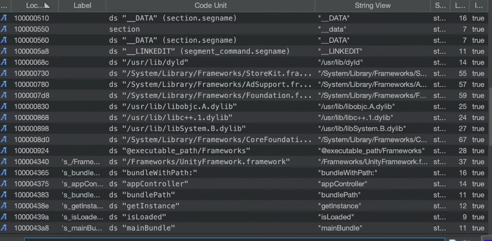

# iOS Game RE & Cheating Writeup: Unity-based arcade game

### Disclaimer
This writeup is for educational and research purposes only.

## Summary
Last night I was bored and decided to have some fun cheating in an iOS arcade shooting game I usually play to kill time. Since it's a basic Unity game, I figured it would be a good case study to share a mini writeup. The techniques involved were pretty straightforward: static analysis, dumping IL2CPP metadata and LLDB usage for memory patching and setting conditional breakpoints combined with LLDB command scripting to modify register values at runtime.

## Writeup
Well, the first and most obvious step was to download the app from the App Store and extract the decrypted IPA from memory.

Then, loading the main Mach-O binary in Ghidra and taking a quick look at strings revealed the presence of `/Frameworks/UnityFramework.framework`, `getInstance`, minimal objc_ selectors and completely stripped method/class data, ...



All of this strongly confirmed that this game was a Unity-based and IL2CPP-compiled binary. Unity is a game engine that allows developers to write gameplay code in C#. IL2CPP (Intermediate Language To C++) is Unity's proprietary backend that takes the C# code, converts it to C++, and compiles it into native ARM64. This compilation process strips managed symbols, so what you see in the binary are opaque function names like FUN_1000xxxx.

Looking at the structure also revealed that the main Mach-O binary acts mostly as a loader. It delegates all the actual game logic to the UnityFramework Mach-O binary, which contains the real IL2CPP-compiled payload. So naturally, our attention shifts there.

IL2CPP metadata is located in `your_app.app/Data/Managed/Metadata/global-metadata.dat`. The UnityFramework binary is usually found at:

```sh
ggrep: ./Frameworks/UnityFramework.framework/UnityFramework: binary file matches
```

IL2CPP allows us to recover class, method, and field names using tools like [IL2CPPDumper](https://github.com/Perfare/Il2CppDumper). This tool outputs reconstructed headers and a `script.json` file which are useful for reverse engineering. Specifically, it dumps:

- A `dump.cs` containing high-level reconstructed C# class structures
- `il2cpp.h`, a C-style header of functions and structs
- `script.json`, a symbol map for tools like Ghidra


Running `il2cpp_header_to_ghidra.py` converts that header into one usable in Ghidra. After generating `il2cpp_ghidra.h`, the next step was to open the UnityFramework binary in Ghidra, load the header using `File > Parse C Source` and then run `ghidra_with_struct.py` from the script manager and provide `script.json` to apply annotations:


Now I had structures, functions, and actual symbols to work with. It was time to find something juicy.

First I went to the in-game shop to see if I could get some items for free.

One of the functions that stood out was `ShopSKU$$get_allItemsUnlocked`. Here's how Ghidra decompiled it:


It looked like a good candidate for patching to make everything appear unlocked. The plan was to overwrite the start of the function like so:

```asm
mov w0, #1
ret
```

This would make the function always return true, skipping logic entirely. But after doing that and running the game, nothing really changed in the shop UI. So I shifted focus to something a bit more active like the function that handles the actual purchase.

I found `ShopEntry$$Buy`. This function figures out if the shop entry will be an offer wall, if you are buying with golden ticket or coins, etc., using flags like `param_1 + 0x98 + 0x31`, bit checks like `param_1 & 1`, ...


I figured I could patch the logic to skip all of that and go straight to the CoinShop behavior, or better, just force the function to always succeed.

Using `debugserver` on the iPhone and `LLDB` on macOS, I attached to the process, waited for UnityFramework to load, and got its base address:


Then I navigated to the shop and located a cool skin priced at 0,99€:


With that, I looked at the decompiled `ShopEntry$$Buy` and used its RVA to compute where to patch in memory and replaced beginning of the function in memory:

  


```sh
memory write --format bytes 0x10E269B38 0x20 0x00 0x80 0x52  0xC0 0x03 0x5F 0xD6
```

Which is:

```asm
mov w0, #0x1
ret
```


After disabling the breakpoint and resuming the app, it just worked, got the item for free:


Note that even after telling LLDB to use UnityFramework with `target create --arch arm64 UnityFramework` LLDB couldn't resolve symbols like `EconomyController$$setPlayerIntForKey`. That’s because these aren't standard symbols, they come from IL2CPP metadata, not traditional symbol tables.

I then went after infinite coins. Found a promising function: `CollectCoinsUnlocker$$coinWasPickerUp`:


Which calls `EconomyController$$setPlayerIntForKey`. Decompiling it:


From the IL2CPPDumper output, specifically the `dump.cs` file, I located the method:

```csharp
void setPlayerIntForKey(char *key, int value);
```

Looking through that file for constants passed to this method, I found several likely candidates:

- "YODO1_GET_COIN_FROM_ONE_GAME"
- "YODO1_COIN_PRIZE_SUCCESSED"
- "YODO1_COIN_PRIZE_NONREPETITIVE"
- "YODO1_VIDEO_GAMEOVER_GET_COIN_SHOW"
- "YODO1_VIDEO_NORMAL_CLICK"
- "YODO1_VIDEO_SUCCESSED"

These keys are likely passed into `setPlayerIntForKey` depending on the situation.

The key `"YODO1_GET_COIN_FROM_ONE_GAME"` looked especially relevant, it stood out as a direct indicator of coins being awarded after a session.

At this point to intercept `setPlayerIntForKey` I computed its runtime address by adding the RVA from `dump.cs` to the base address of UnityFramework:

```csharp
// RVA: 0x2D40D4 Offset: 0x2D40D4 VA: 0x2D40D4
public static void setPlayerIntForKey(string theKey, int theValue) { }
```


That gave me a valid breakpoint on the native function behind `setPlayerIntForKey`. I then modified the breakpoint to make it conditional, so it would only trigger when the first argument (the key string in x0) contained the substring `"COIN"`:


This throws an error but it still works, LLDB just can’t infer the return type, which we ignore.

Before running it, I checked current coins and general status:


After making it conditional, I attached a breakpoint command that would automatically overwrite the value passed in `w1` (the second parameter, representing the new int value) with `9999`:


Keys that were triggered included:

- "COIN_TOTAL"
- "GOLDEN_COIN_COUNT"
- "TROPHY_COIN_BALANCE"
- "COIN_SCORE"
- "DAILY_COIN_REWARD"

The filter was catching every coin-related stat and overriding them. That’s because most economy stats used keys with `"COIN"` in the name.

I also had the breakpoint command configured like:

```
register write w1 9999
```

Which overwrites the second parameter passed to:

```charp
void setPlayerIntForKey(char *key, int value);
```

So every time the game tried to save any stat labeled with `"COIN"`, it just saved `9999` instead. I probably could've filtered more selectively but it worked and gave me a ton of money and trophies at once :)


Next possible cheat: infinite score. `BouncingBallCatcher$$increaseScore` was a good candidate. Again, this ties back to `EconomyController`, so a similar strategy could work:


You could even patch health functions like `playerHasDied()` to avoid dying by just nopping out the `set_enabled` calls or force early returns.

Once validated all the mods to apply, one can apply them statically with a disassembler and repack a modded IPA or build a sideloaded modding app that applies patches dynamically.

This was a fun exercise in iOS reverse engineering, using Unity’s IL2CPP structure and LLDB-based patching. With just some light scripting and memory editing, it’s possible to unlock, cheat, and override behaviors in simple mobile games.
